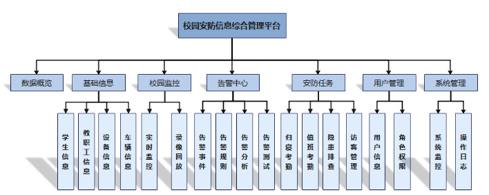

<h1 align="center" style="margin: 30px 0 30px; font-weight: bold;">图安校园安防综合管理平台 v1.0</h1>
<h4 align="center">基于Vue开发的管理平台</h4>

## 平台简介

图安校园安防综合管理平台，采用vue框架，实现了与微信小程序[tuan-wx-ui](https://github.com/QJC1123/tuan-wx-ui)对接的移动解决方案！智能识别校园监控视频，发现安全隐患并进行告警通知。属于“校园安防智能保障系统”的平台之一，“校园安防智能保障系统”项目获第十四届服务外包创新创业大赛**国家级二等奖**，授权软件著作权1项。

平台目前已经实现登录、学校接入管理、安防基础信息管理、校园实时监控查看、监控录像回放、告警事件展示、告警参数配置、告警数据分析、告警功能检测、微信小程序安防任务管理、用户管理等功能。

* 应用框架基于[vue](https://cn.vuejs.org/guide/introduction.html)。
* 前端组件采用[element-ui](https://www.uihtm.com/element/#/zh-CN)，全端兼容的高性能UI框架。
* [Echarts](https://echarts.apache.org/zh/index.html)展示多种多种图表。
* 实现浏览器播放Rtsp监控视频流

## 功能模块

1. 平台概览
系统管理员登录后，可视化呈现后台设备信息、数据信息，概览校园安防各项数据和应用、最新告警信息、值班安排。并提供信息传递的交互窗口。
2. 数据总览
概览校园安防各项数据和应用、最新告警信息、值班安排。
3. 基础信息
管理学生信息、教职工信息、停车场车辆信息、各类设备信息、食堂卫生等信息。支持数据的增删改查，数据包含照片的个人信息便于人脸识别和以图搜脸定位人员轨迹。
4. 校园监控
选择摄像头，查看实时监控；选择摄像头及日期，查看历史监控。
5. 告警中心
管理人员可查询所有告警通知，查看告警处理进度。配置告警通知规则，规定告警类型级别和对应的部门。实时通过校园安防小程序、校园安防公众号和校园安防邮箱助手进行告警通知。
对应安保人员可查询自己的告警通知，认领告警任务。
6. 安防任务
对接微信小程序。
安保人员可以查询学生寝室考勤打卡的异常情况、查询并审核校外访客申请信息、查询上报的隐患信息。
安保管理人员可查询保安值班巡逻安排及到岗情况。
7. 用户管理
管理员可查询配置系统中的角色（保安、学生、家长、食堂管理人员、后勤维修人员等）及权限，修改个人信息。
8. 系统管理
可进行数据监控，查询CPU、内存等信息。查询管理员操作日志信息。

## 演示图

<table>
    <tr>
        <td>登录总览</td>
        <td>
            
            
&nbsp;&nbsp;&nbsp;&nbsp;&nbsp;&nbsp;&nbsp;&nbsp;&nbsp;&nbsp;&nbsp;&nbsp;&nbsp;&nbsp;&nbsp;&nbsp;&nbsp;&nbsp;登录界面

        </td>
        <td>
            
            
&nbsp;&nbsp;&nbsp;&nbsp;&nbsp;&nbsp;&nbsp;&nbsp;&nbsp;&nbsp;&nbsp;&nbsp;&nbsp;&nbsp;&nbsp;&nbsp;&nbsp;&nbsp;平台总览

        </td>
        <td>
            
            
&nbsp;&nbsp;&nbsp;&nbsp;&nbsp;&nbsp;&nbsp;&nbsp;&nbsp;&nbsp;&nbsp;&nbsp;&nbsp;&nbsp;&nbsp;&nbsp;&nbsp;&nbsp;学校总览

        </td>
    </tr>
    <tr>
        <td>基础信息</td>
        <td>
            
            
&nbsp;&nbsp;&nbsp;&nbsp;&nbsp;&nbsp;&nbsp;&nbsp;&nbsp;&nbsp;&nbsp;&nbsp;&nbsp;&nbsp;&nbsp;&nbsp;&nbsp;&nbsp;人员信息

        </td>
        <td>
            
            
&nbsp;&nbsp;&nbsp;&nbsp;&nbsp;&nbsp;&nbsp;&nbsp;&nbsp;&nbsp;&nbsp;&nbsp;&nbsp;&nbsp;&nbsp;&nbsp;&nbsp;&nbsp;设备信息

        </td>
        <td>
            
            
&nbsp;&nbsp;&nbsp;&nbsp;&nbsp;&nbsp;&nbsp;&nbsp;&nbsp;&nbsp;&nbsp;&nbsp;&nbsp;&nbsp;&nbsp;&nbsp;&nbsp;&nbsp;车辆信息

        </td>
    </tr>
    <tr>
        <td>校园监控</td>
        <td>
            
            
&nbsp;&nbsp;&nbsp;&nbsp;&nbsp;&nbsp;&nbsp;&nbsp;&nbsp;&nbsp;&nbsp;&nbsp;&nbsp;&nbsp;&nbsp;&nbsp;&nbsp;&nbsp;实时监控

        </td>
        <td>
            
            
&nbsp;&nbsp;&nbsp;&nbsp;&nbsp;&nbsp;&nbsp;&nbsp;&nbsp;&nbsp;&nbsp;&nbsp;&nbsp;&nbsp;&nbsp;&nbsp;&nbsp;&nbsp;录像列表

        </td>
        <td>
            
            
&nbsp;&nbsp;&nbsp;&nbsp;&nbsp;&nbsp;&nbsp;&nbsp;&nbsp;&nbsp;&nbsp;&nbsp;&nbsp;&nbsp;&nbsp;&nbsp;&nbsp;&nbsp;录像回放

        </td>
    </tr>
    <tr>
        <td>告警事件</td>
        <td>
            
            
&nbsp;&nbsp;&nbsp;&nbsp;&nbsp;&nbsp;&nbsp;&nbsp;&nbsp;&nbsp;&nbsp;&nbsp;&nbsp;&nbsp;&nbsp;&nbsp;&nbsp;&nbsp;告警列表

        </td>
        <td>
            
            
&nbsp;&nbsp;&nbsp;&nbsp;&nbsp;&nbsp;&nbsp;&nbsp;&nbsp;&nbsp;&nbsp;&nbsp;&nbsp;&nbsp;&nbsp;&nbsp;&nbsp;&nbsp;详情面板

        </td>
        <td>
            
            
&nbsp;&nbsp;&nbsp;&nbsp;&nbsp;&nbsp;&nbsp;&nbsp;&nbsp;&nbsp;&nbsp;&nbsp;&nbsp;&nbsp;&nbsp;&nbsp;&nbsp;&nbsp;数据分析

        </td>
    </tr>
     <tr>
        <td>告警配置</td>
        <td>
            
            
&nbsp;&nbsp;&nbsp;&nbsp;&nbsp;&nbsp;&nbsp;&nbsp;&nbsp;&nbsp;&nbsp;&nbsp;&nbsp;&nbsp;&nbsp;&nbsp;&nbsp;&nbsp;配置列表

        </td>
        <td>
            
            
&nbsp;&nbsp;&nbsp;&nbsp;&nbsp;&nbsp;&nbsp;&nbsp;&nbsp;&nbsp;&nbsp;&nbsp;&nbsp;&nbsp;&nbsp;&nbsp;&nbsp;&nbsp;检测配置

        </td>
        <td>
            
            
&nbsp;&nbsp;&nbsp;&nbsp;&nbsp;&nbsp;&nbsp;&nbsp;&nbsp;&nbsp;&nbsp;&nbsp;&nbsp;&nbsp;&nbsp;&nbsp;&nbsp;&nbsp;通知配置

        </td>
    </tr>
     <tr>
        <td>告警测试</td>
        <td>
            
            
&nbsp;&nbsp;&nbsp;&nbsp;&nbsp;&nbsp;&nbsp;&nbsp;&nbsp;&nbsp;&nbsp;&nbsp;&nbsp;&nbsp;&nbsp;&nbsp;&nbsp;&nbsp;测试配置

        </td>
        <td>
            
            
&nbsp;&nbsp;&nbsp;&nbsp;&nbsp;&nbsp;&nbsp;&nbsp;&nbsp;&nbsp;&nbsp;&nbsp;&nbsp;&nbsp;&nbsp;&nbsp;&nbsp;&nbsp;测试结果

        </td>
    </tr>
    <tr>
        <td>安防任务</td>
        <td>
            
            
&nbsp;&nbsp;&nbsp;&nbsp;&nbsp;&nbsp;&nbsp;&nbsp;&nbsp;&nbsp;&nbsp;&nbsp;&nbsp;&nbsp;&nbsp;&nbsp;&nbsp;&nbsp;归寝打卡

        </td>
        <td>
            
            
&nbsp;&nbsp;&nbsp;&nbsp;&nbsp;&nbsp;&nbsp;&nbsp;&nbsp;&nbsp;&nbsp;&nbsp;&nbsp;&nbsp;&nbsp;&nbsp;&nbsp;&nbsp;值班考勤

        </td>
    </tr>
    <tr>
        <td>安防任务</td>
        <td>
            
            
&nbsp;&nbsp;&nbsp;&nbsp;&nbsp;&nbsp;&nbsp;&nbsp;&nbsp;&nbsp;&nbsp;&nbsp;&nbsp;&nbsp;&nbsp;&nbsp;&nbsp;&nbsp;隐患排查

        </td>
        <td>
            
            
&nbsp;&nbsp;&nbsp;&nbsp;&nbsp;&nbsp;&nbsp;&nbsp;&nbsp;&nbsp;&nbsp;&nbsp;&nbsp;&nbsp;&nbsp;&nbsp;&nbsp;&nbsp;访客管理

        </td>
    </tr>
    <tr>
        <td>用户管理</td>
        <td>
            
            
&nbsp;&nbsp;&nbsp;&nbsp;&nbsp;&nbsp;&nbsp;&nbsp;&nbsp;&nbsp;&nbsp;&nbsp;&nbsp;&nbsp;&nbsp;&nbsp;&nbsp;&nbsp;用户信息

        </td>
        <td>
            
            
&nbsp;&nbsp;&nbsp;&nbsp;&nbsp;&nbsp;&nbsp;&nbsp;&nbsp;&nbsp;&nbsp;&nbsp;&nbsp;&nbsp;&nbsp;&nbsp;&nbsp;&nbsp;角色权限

        </td>
    </tr>
    
</table>

## 开发
        # 克隆项目
        git clone https://github.com/QJC1123/tuan-admin-ui

        # 进入项目目录
        cd tuan-wx-ui

        # 安装依赖
        npm install

        # 启动服务
        npm run dev

